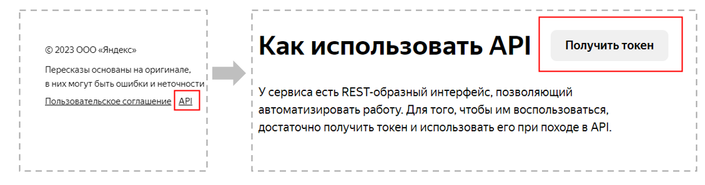

<!-- README.md is generated from README.Rmd. Please edit that file -->

# r300ya

<!-- badges: start -->
<!-- badges: end -->

Пакет **r300ya** предназначен для доступа с помощью языка R к сервису
Яндекса <https://300.ya.ru> c помощью API. С помощью сервиса можно
автоматически сгенерировать сокращенное описание Интернет-страниц с
использованием технологий искусственного интеллекта, т.е. сделать
Пересказ.

## Установка

Установить **r300ya** можно с [GitHub](https://github.com/) с помощью
следующей команды:

``` r
# install.packages("devtools")
devtools::install_github("KobzevAY/r300ya")
```

## Пример

Основная функция *retell_text* принимает на вход 2 параметра:

- URL: ссылка на оригинальную страницу

- token: токен, который авторизованный пользователь сервиса 300.ya.ru
  может получить

``` r
library(r300ya)

my_url <- 'https://habr.com/ru/news/729422/'
my_token <- 'some_secret_information'

retell_text(url = my_url, token = my_token)
#> Check your token

# $title
# [1] "«Яндекс Браузер» научили переводить с китайского языка и автоматически накладывать русскую озвучку"
# 
# $short_text
# [1] "Яндекс Браузер научился переводить видео с китайского языка и накладывать русскую озвучку."            
# [2] "Технология уже работает на YouTube и будет доступна на китайской видеоплатформе Bilibili."             
# [3] "Разработчики собрали датасет из 1,5 млн видео и выбрали 100 тыс. с качественными субтитрами."          
# [4] "Нейросети научились понимать иероглифы и делить сплошной поток иероглифов на смысловые отрезки."       
# [5] "Разработчики утверждают, что нейросеть справилась с изучением четырёх тонов китайского языка за месяц."
# [6] "Браузер учитывает контекст при различии омофонов в китайском языке."                                   
# [7] "Технология описана в статье разработчиков."                                                            
# 
# $short_url
# [1] "https://300.ya.ru/3fOcYRBL"
# 
# $original_url
# [1] "https://habr.com/ru/news/729422/"
```

Оригинальная страница может быть на любом языке, YandexGPT попробует ее
пересказать.

## Ограничения

Вместе с тем, есть ряд ограничений:

- Страница не может быть слишком длинной

- Ссылка может вести на файл, например \*.pdf

- В целом страница не можеть быть обработана (например, очень мало
  текста)

В этом случае web-версия сервиса <https://300.ya.ru/> выдает ошибки:

    Статья слишком длинная, нейросети пока не умеют пересказывать такие статьи. Попробуйте другую

или

    Нейросеть не смогла извлечь текст статьи. Попробуйте другую

В **r300ya** в этих случаях выдается следующее сообщение:

    The neural network was unable to extract the text of the article. Perhaps the article is too long, and neural networks are not yet able to retell such articles. Try another.

## Получение токена

Токен может получить авторизованный пользователя сервисов яндекса по
следующей схеме

<figure>

<figcaption aria-hidden="true">Схема получения значения токена на
сервисе 300.ya.ru</figcaption>
</figure>
